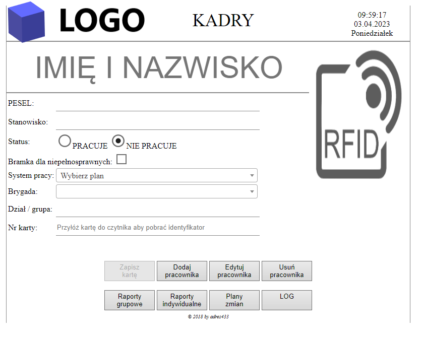
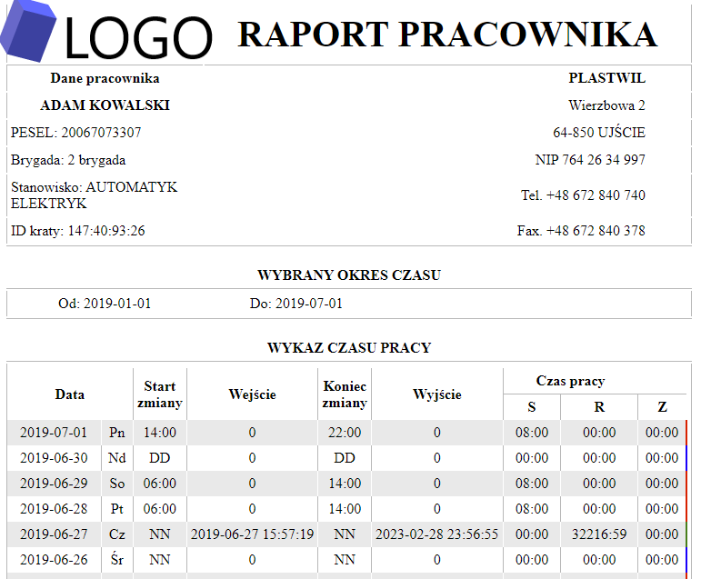

# RCP - Rejestracja Czasu Pracy

### Table of content

- [Description EN](#description-pl)
- [Technologies](#technologies)
- [How start](#how-start)
- [Description PL](#description-pl)

### DESCRIPTION EN

Work time register system cooperates with RFID readers, which be place near entrances to factory.

Each workers scan own RFID card and register entry time or exit time from factory.
Each happen is registered in database and show at display ex. in security room. 

Security man get infromation about scanned worker, that as:

- Name and surname
- Card no
- Current shift
- Acces granted or not

Addition security man can display list all workers currently into factory - this function is very important ex. during evacuations.
Lists show: absent workers, present workers and mark all workers in overtime - all according schedudle.

Security man can also add new happen to registry (entry or exit happends), ex. when workers loss own card - 
this happend is mark as "manual" and have to have decription with cause, or when worker didn't scan own card 
**!!WARNING!!** you make sure that worker sure leave the factory.

Addition security man can display list all workers currently into factory - this function is very important ex. during evacuations.
Lists show: absent workers, present workers and mark all workers in overtime - all according schedudle.

Security man can also add new happen to registry (entry or exit happends), ex. when workers loss own card - this happend is mark as "manual" and have to have decription with cause, or when worker didn't scan own card #!!WARNING!!# you make sure that worker sure leave the factory.

At the top is field with happends from RFID readers added in real time.

RFID readers cooperates entrace gates and after acces granted opened the gate - normal or for disableds.

Interface for HR:

- Edit, delete and add new workers and assign RFID card
- Display RFID readers happends registry
- Insert, edit  and delete work schedules - ex. shift work
- Generate hours reports for each workers and over teams
- Generate reports and logs with diffrents intervals
- Each report have information about worker, entry time, exit time and registred work time. - system automaticaly register work time on schedule, all overtime are accepted by HR team based on worker application or manager.
- In report marked are informations about late, overtime and early exit.
- Reports can be generate to browser, pdf file or excel file.

RFID readers:

Personalized reader box adapted to wall mount and on gate.
RFID readers can also to lie on a flat surface of desk.

Every reader comunicate to factory network by WiFi.
And UART interface in order to setting and diagnose.
UART is avaliable by micro USB port which is on a wall of box.

### TECHNOLOGIES
 - PHP 5.4.17
 - ARDUINO + ESP32
 - 3D PRINT - AUTOCAD
 - MYSQL
 - JavaScript - JQUERY
 - AJAX - WEBSOCKETS
 - HTML, CSS
 - TCPDF

### HOW START

- Install web server with PHP >= 5.4.17 ex. [USBWebserver](https://www.usbwebserver.net/webserver/)
- In [phpmyadmin](http://localhost/phpmyadmin) you import rcp.sql to database
- Set user privillages in phpmyadmin to "rcp" table
- Change login data in connecting.php
- Start in [localhost](http://localhost)
- If you would like, you can add new happend to registry by [try.php](http://localhost/try.php) 
- You have to write card no in first field (ex. "147:40:93:26") and comment in second field (ex. "Manual out")

### DESCRIPTION PL

System rejestracjii czasu opiera sie na czytnikach odczytach z czytników
RFID umieszczonych przy wejściach do zakładu.

Użytkownicy skanują swoje karty RFID i rejestrują czas wejścia bądź wyjścia z zakładu.
Każde zdarzenie czytnika jest rejestrowane w bazie danych oraz wyświetlane na ekranie 
monitora np. w portierni.

Portier otrzymuje informację na temat wchodzacego i wychodzącego pracownika takie jak:

- Imię i nazwisko
- Nr karty
- Aktualna zmiana
- Aktualny dostęp

Dodatkowo portier ma możliwość wyświetlenia listy wszystkich osób będących aktualnie w zakładzie
oraz osób przebywających w zakładzie poza swoją zmianą - nadgodziny i osób nieobecnych - wg. harmonogramu.
Równocześnie posiada możliwość wprowadzenia ręcznych zdarzeń do rejestru - np. w przypadku zgubienia karty 
przez pracownika lub w przypadku nie odbicia się pracownika i stwierdzeniu jesgo nieobecności w zakładzie
- co jest odnotowywane w rejestrze jako zdarzenie manualne.

U góry interfejsu widnieje log wszystkich zdarzeń systemu aktualizowany na bierząco.

Czytniki współpracują z bramkami wejściowymi i po przyznaniu dostępu otwierają bramkę pracownikowi.

Część interfejsu przeznaczona dla działu HR:

- Edycja, usuwanie i dodawanie nowych pracowników do systemu i przypisanie karty RFID
- Wyświetlanie rejestrów zdarzeń z czytników
- Wprowadzanie, edycja i usuwanie harmonogramów pracy - praca zmianowa
- Generowanie raportów godzinowych dla poszczególnych pracowników i całych działów
- Generowanie raportów i logów z różnych przedziałów czsowych
- Każdy raport zawiera informację o godzinie wejścia i wyjścia, zarejestrowanym czasie pracy - wg. harmonogramu
- W raportach wyróżnione są informację na temat spóźnień (rególowanych ustawieniami), nadgodzin, wcześniejszych wyjść
- Raporty można generować do przeglądarki, pliku pdf oraz xls.

Czytniki RFID:

Presonalizowana obudowa czytników przystosowana do montażu na elewacji bramki oraz na ścianie.
Czytnik można również pozostawić na każdej płaskiej powierzchni jako samodzielne urządzenie np. na blacie biórka.

Kazdy czytnik komunikuje się z siecią zakładową przy pomocy WIFI.
Czytniki posiadają interfejs komunikacyjny w celu ich konfiguracji oraz diagnostyki,
aby z niego skorzystać potrzebujemy podłaczyć czytnik do komputera poprzez złącze micro usb umieszczone
na boku czytnika oraz zainicjalizować komunikację USART.
